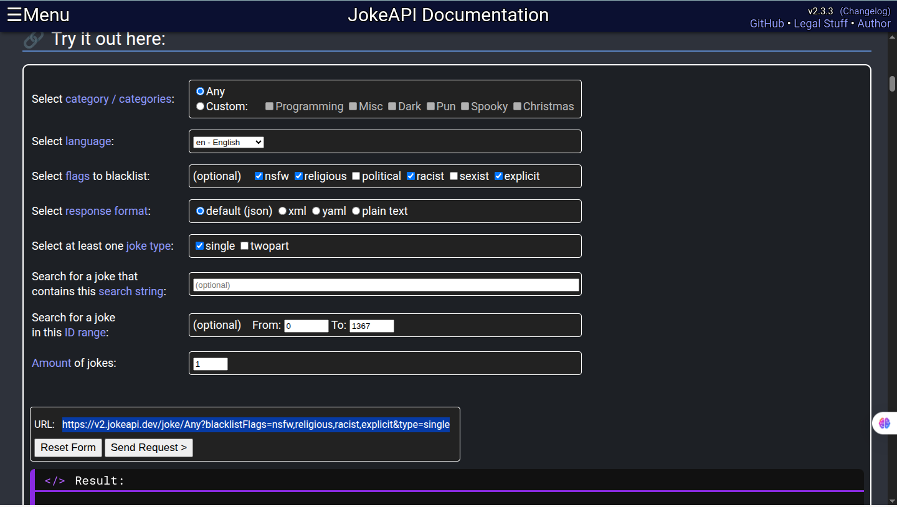

# How I Approached the problem
I didnt know about apis so i will first read about it in python3 -c 'import requests; help('requests')'
that didnt help much (it only told me about the functions) T-T..

I searched the web and ai to find some free apis i dont need to give credit card for...
And i found this:- https://github.com/public-apis/public-apis
inside which i found an awesome api for INshorts news... https://github.com/cyberboysumanjay/Inshorts-News-API

the INShorts api isnt working so i went to the same github public apis and found out a jokes api which has a good filter and even gets the specific url according to our needs 'https://jokeapi.dev/'
# Challenges faced
    not understanding what it actually gives or what params are...
    API not working
# Resources/ Research done
    chatgpt.com
    github.com
    https://jokeapi.dev/
    https://rich.readthedocs.io/en/latest/
# What did i learn
    how to use APIs and how to use requests library
    not all apis work and test them before using
# Screenshots if applicable

